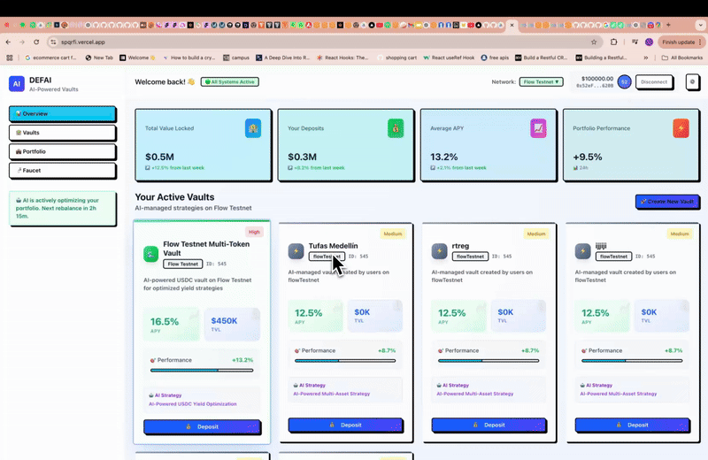
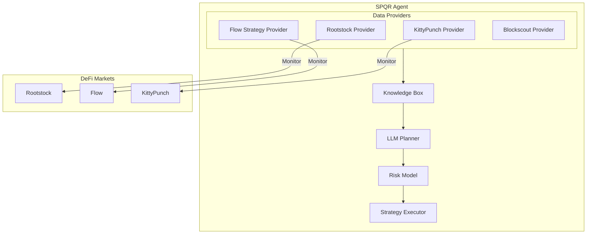

# 🤖 SPQRFi


> **Advanced DeFi vault system with AI-driven strategy execution and multi-chain support**



## 📋 Overview

SPQRFi is a sophisticated DeFi protocol that combines traditional ERC4626 vault functionality with AI-driven strategy execution. The system leverages a deterministic AI system (SPQR Agent) that monitors and executes strategies across Flow and Rootstock ecosystems, implementing cross-protocol yield optimization with LLM-based planning and multi-layered risk assessment.

### Key Features

- **SuperVaults**: Specialized liquidity pools that aggregate user deposits and prepare them for deployment
- **AI-Driven Strategy**: Automated investment decisions based on real-time yield and risk analysis
- **User Dashboard**: Real-time portfolio monitoring and performance tracking
- **Automated Rebalancing**: AI-managed portfolio adjustments for optimal yields
- **Risk Management**: Dynamic risk assessment and mitigation with Allora Network
- **Multi-signature Security**: Safe integration for secure transaction approval
- **Gas-Optimized Execution**: Transactions only execute when yield improvements exceed gas costs
- **Protocol-Agnostic Architecture**: Compatible with lending markets, AMMs, liquid staking, and more

## 🧠 AI Agent Architecture

## System Overview



For a detailed view of the system architecture, including strategy flows, risk assessment, and monitoring parameters, see our [SPQR Architecture Documentation](https://github.com/lausuarez02/SPQR-AI-vaults-praha/blob/main/docs/SPQR_ARCHITECTURE.md).

The SPQR Agent is our deterministic AI system that:

### Core Capabilities
- Monitors and executes strategies across Flow and Rootstock ecosystems
- Implements cross-protocol yield optimization
- Uses LLM-based planning for strategy generation
- Employs multi-layered risk assessment
- Executes approved strategies with multi-sig security

### Risk Assessment System

1. **Protocol Risk**
   - TVL monitoring
   - Liquidity depth analysis
   - Smart contract risk scoring
   - Historical pattern matching

2. **Market Risk**
   - Volatility tracking
   - Price impact analysis
   - Slippage protection
   - Liquidation risk assessment

3. **Execution Risk**
   - Gas optimization
   - Transaction sequencing
   - Multi-sig verification
   - Rate limiting

### Security Features
- **Deterministic Execution**: No randomness in strategy generation
- **Multi-sig Protection**: All transactions require multiple signatures
- **Risk Scoring**: Every strategy is scored before execution
- **Real-time Monitoring**: Continuous protocol health checks
- **Emergency Shutdown**: Automatic response to unusual events
- **Fund Security**: Agent has no direct access to funds, only updates contract state
- **Off-chain Analysis**: Combines on-chain and off-chain data for comprehensive risk assessment

## 🚀 Tech Stack

### Frontend
- **Next.js 15** - React framework for production
- **TailwindCSS** - Utility-first CSS framework
- **shadcn/ui** - Reusable component system
- **Studiofreight Hamo** - Animation libraries
- **Lenis scroll** - Smooth scrolling
- **RainbowKit** - Wallet connection interface
- **Wagmi** - React Hooks for Ethereum

### Blockchain & Security
- **Viem** - TypeScript Ethereum library
- **Flow** - Primary DeFi operations chain
- **Rootstock** - BTC security and yield operations
- **Blockscout** - Historical data provider and event monitoring

### Partner Integrations
- **Flow** - Defi integration
- **Rootstock** - BTC l2 to use bitcoin in evm
- **Blockscout** - API rest for historical data


### AI/ML Components
- Custom AI agent (SPQR Council) for:
  - Market analysis
  - Protocol risk profiling
  - Yield optimization
  - Cross-chain strategy execution
  - Historical data analysis via Blockscout API

## 📁 Project Structure

```
ai-vaults-front-end/
├── app/                    # Next.js main application
│   ├── api/               # API endpoints
│   └── ...
├── components/            # Reusable components
│   ├── ui/               # UI components
│   ├── vault-card.tsx
│   ├── deposit-modal.tsx
│   ├── withdraw-modal.tsx
│   ├── create-vault-modal.tsx
│   ├── nav-bar.tsx
│   ├── protocol-list.tsx
│   ├── stats-overview.tsx
│   ├── token-faucet.tsx
│   ├── transaction-history.tsx
│   ├── ai-insights.tsx
│   └── ...
├── contexts/             # React contexts
├── hooks/                # Custom hooks
├── lib/                  # Utilities and configurations
└── constants/            # Constants and configurations
```

## 🔗 Additional Repositories

- **Smart Contracts:** [AI-VAULTS](https://github.com/tomi204/AI-VAULTS)
- **Frontend:** [ai-vaults-front-end](https://github.com/tomi204/ai-vaults-front-end)
- **AI Agent & Risk Models:** [SPQR-AI-vaults-praha](https://github.com/lausuarez02/SPQR-AI-vaults-praha)

## 🎯 Market Position

SPQRFi uniquely occupies the high-yield + passive management quadrant in the DeFi landscape:
- Delivers Morpho-level yields with Superform-level passivity
- Combines the best of active management returns with passive user experience
- Uses AI to bridge the gap between yield and convenience

## 🚀 Getting Started

First, run the development server:

```bash
npm run dev
# or
yarn dev
# or
pnpm dev
# or
bun dev
```

Open [http://localhost:3000](http://localhost:3000) with your browser to see the result.

## 🛡️ Security Features

- Modular vault design for strategy isolation
- Automated security monitoring
- Regular security assessments
- Time-locked operations for critical changes
- Agent has no direct access to funds
- State-only updates through smart contracts

## 🎮 Governance: The SPQR Council

The AI SPQR Council is our governance framework that allows users to:
- Propose new investment strategies
- Vote on protocol parameters
- Participate in strategic decisions
- Earn rewards for successful strategy contributions

## 📈 Roadmap

- Expansion to additional L1/L2 networks
- Specialized vaults for different asset classes
- Enhanced AI models with additional data sources
- Advanced governance framework for the SPQR AI Council

## 🤝 Contributing

Contributions are welcome! Please read our contributing guidelines before submitting pull requests.

## 📄 License

This project is licensed under the MIT License - see the LICENSE file for details.

## 🙏 Acknowledgments

- [Flow Documentation](https://docs.onflow.org/)
- [Rootstock Documentation](https://developers.rsk.co/)
- [Blockscout Documentation](https://docs.blockscout.com/)
- [Next.js Documentation](https://nextjs.org/docs)
- [RainbowKit](https://www.rainbowkit.com/)
- [Wagmi Hooks](https://wagmi.sh/)

## 🌐 Live Deployment

SPQRFi is currently live on Flow and Rootstock with active DeFi strategies that are automatically allocating capital based on AI-driven analysis.

**Live Demo:** [https://spqrfi.vercel.app/](https://spqrfi.vercel.app/)

## Why does SPQRFi use off-chain AI agents?

Off-chain yield farming analysis allows for a level of intelligence and adaptability that on-chain systems simply can't match. AI agents operating off-chain have access to real-time data from across the web — including market trends, macroeconomic indicators, and on-chain analytics — giving them a broader and more accurate decision-making base.

They also benefit from advanced computational resources: high-speed processors, complex machine learning models, and constant upgrades, all without the limitations of gas fees, blockchain latency, or smart contract rigidity.

The result? Smarter, faster, and more effective strategies that evolve with the market. SPQRFi harnesses this power to seek, compare, and execute the best DeFi opportunities for you — securely, intelligently, and with zero friction.
